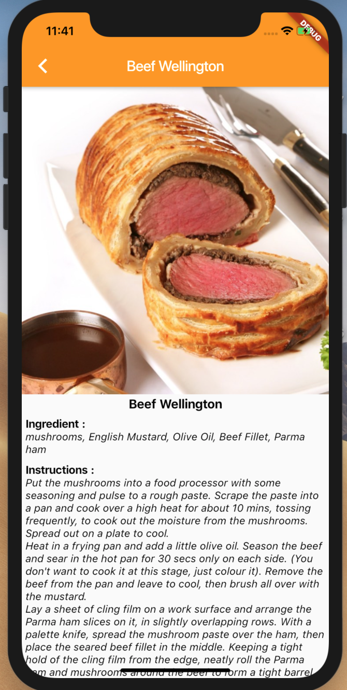
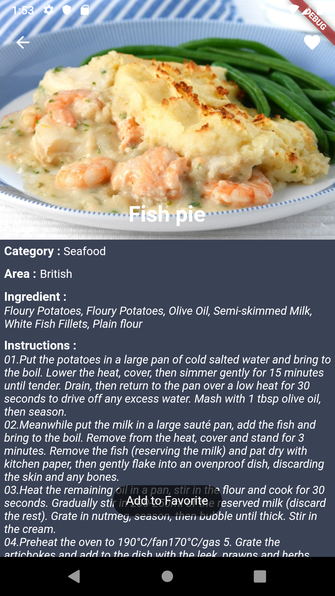

# Meals Catalogue

All submission MFDE (Menjadi Flutter Developer Expert) class from <a href="https://www.dicoding.com/academies/110/">dicoding</a> 

## Branch submission-4 (Final Project)
### Screenshot

<pre>
          
</pre>

### Feature

* [x] <a href="https://pub.dev/packages/http">Http</a>
* [x] <a href="https://pub.dev/packages/rxdart">Rx Dart</a>
* [x] <a href="https://medium.com/flutterpub/effective-bloc-pattern-45c36d76d5fe">BLoC</a>
* [x] <a href="https://pub.dev/packages/curved_navigation_bar">Curved Navigation Bar</a>
* [x] <a href="https://pub.dev/packages/toast">Toast</a>
* [x] Collapsing Toolbar
* [x] <a href="https://flutter.dev/docs/development/ui/animations/hero-animations">Hero Animation</a>
* [x] Search
* [x] <a href="https://pub.dev/packages/sqflite">Favorite (SQFlite)</a>
* [x] <a href="https://flutter.dev/docs/deployment/flavors">Flavor</a>
* [x] <a href="https://flutter.dev/docs/cookbook/testing/unit/mocking">Unit Testing (Mockito)</a>
* [x] <a href="https://flutter.dev/docs/cookbook/testing/integration/introductionIntegration">Instrumentation Testing</a>

## Author

* **R Rifa Fauzi Komara**

Jangan lupa untuk follow dan ★
